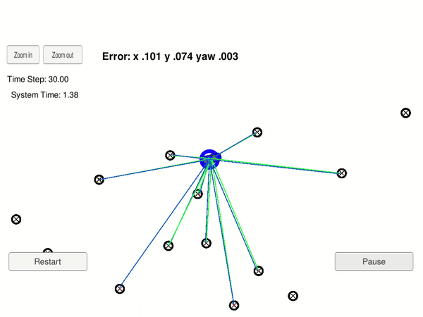
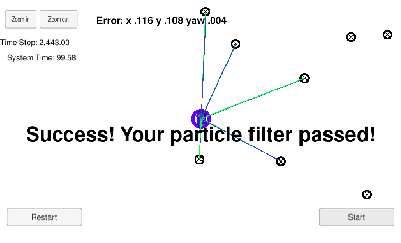

# Localization with Particle Filters
This repository was created as a submission for the Localization project of Udacity's Self Driving Car Nanodegree. The goal of the Localization project was to implement a particle filter in C++ and test it against Udacity's simulator.


## Overview
The main objective of this project was the localization of a vehicle based on an initial GPS measurement and subsequent measurements of the surrounding landmarks, using a particle filter. The implementation files can be found in the ```src``` directory.



## Localization and particle filters

The goal of localization is to estimate the position of a vehicle with a relatively small error. Using GPS coordinates would be the most obvious method to estimate an object's position, but the accuracy of GPS data is not sufficient to reliably estimate a vehicle on the road. Luckily, other sensor (e.g. camera, radar, lidar) and control data (e.g. speed from an odometer) can be used to estimate the position of a vehicle with high accuracy.

Particle filtering is a method used to process noisy sensor and control data and estimate the position of an object. Since all sensor measurements contain some amount of noise, the position of a vehicle cannot be exactly calculated; instead a probability is assigned to a set of position estimates. The "particles" of the particle filter represent the position estimates of the vehicle, and using the sensor and control data, as well as a map of the surrounding space, each particle is assigned a weight. This weight is calculated by comparing the sensor data with the environment of each particle, checking how well these two match. If they match, it can be assumed that the position estimate of the particle is good, if not, it is probably wrong. Calculating these weights is called the update step.

Since the goal is to have an accurate estimate of the vehicle, after calculating weights for each particle, the particles are resampled, favoring the particles with high weights. The position of each of the particles is then recalculated (remember, the vehicle is moving) based on control data (e.g. speed): this is called the prediction step. After this the new sensor data is compared with each particle's new environment.

By repeating the [prediction step - update step - resample] cycle, the particles with accurate position estimates will "survive" with a higher probability, leading to a very accurate estimate of the vehicle's position.

The steps of a particle filter can be summarized with the following flowchart:


## Inputs


The inputs to the particle filter are the following:
* Map: the map is basically a list of landmarks in a cartesian coordinate system, characterized by their x-y coordinates and an individual landmark ID. This data is provided in ```data/map_data.txt```.
* Initial measurement data: an initial measurement of coordinates and yaw rate, used to initialize the particle filter. This corresponds to ```sense_x```, ```sense_y```, ```sense_theta``` in ```main.cpp``` and is provided in the map's coordinate system.
* Observation data: coordinates of observed landmarks within the sensing range of the vehicle, provided in vehicle coordinates (i.e., the vehicle is at the origin). This corresponds to ```sense_observations_x```, ```sense_observations_y``` in ```main.cpp```.
* Control data: velocity and yaw rate measured by the control sensors of the vehicle and used to predict the next state of the vehicle. This corresponds to ```previous_velocity``` and ```previous_yawrate``` in ```main.cpp```.


The map data is read from the ```data``` directory, while the initial measurement data, observation data and control data are sent from the simulator to the executable program through the websocket.


## Outputs


The executable particle filter program outputs the following data to the simulator:
* Coordinates of the "best" particle: the particle with the highest weight is provided to the simulator where it is used for error calculation. This corresponds to ```best_particle_x```, ```best_particle_y``` and ```best_particle_theta``` in ```main.cpp```.
* Debug information about particles: this is optional message data used for debugging the particles' sensing and associations. This corresponds to ```best_particle_associations```, ```best_particle_sense_x``` and ```best_particle_sense_y``` in ```main.cpp```.


## Implementation of the particle filter

The particle filter is implemented in files ```particle_filter.cpp``` ```particle_filter.h``` in the ```src``` directory. The ```ParticleFilter``` class uses ```Particle``` structs to handle a set of particles, initialized in the ```ParticleFilter::init``` function. The main steps of the filter are defined in the following three functions:

* ```ParticleFilter::prediction```
* ```ParticleFilter::updateWeights```
* ```ParticleFilter::resample```

The ```ParticleFilter::dataAssociation``` function is a helper function to the update step, used to associate each measurement with an individual landmark, which is necessary to calculate the weights of the particles.


## Running the Code
This project uses the Udacity Simulator which can be downloaded [here](https://github.com/udacity/self-driving-car-sim/releases).

The repository includes two files that can be used to set up and install uWebSocketIO for either Linux or Mac systems (```install-mac.sh``` and ```install-ubuntu.sh```).

Once the install for uWebSocketIO is complete, the main program can be built and ran by running the following commands from the project top directory:

1. `./clean.sh`
2. `./build.sh`
3. `./run.sh`


## Pass criteria for the project

1. **Accuracy**: The particle filter should localize vehicle position and yaw to within the values specified in the parameters ```max_translation_error``` and ```max_yaw_error``` in ```src/main.cpp```.

2. **Performance**: The particle filter should complete execution within the time of 100 seconds.

## Results and Summary

The particle filter successfully met the pass criteria on my local machine with the follownig results:
* `error_x`: 0.116 m
* `error_y`: 0.108 m
* `error_theta`: 0.004 rad
* `time`: 99.58 s

The main issue with this implementation of the particle filter is that is uses the "Nearest Neighbor" method to associate the measurements with landmarks, which has a time complexity of O(n*m), making the filter very slow. This could be improved by using other data association methods, but these where out of the current project's scope.

